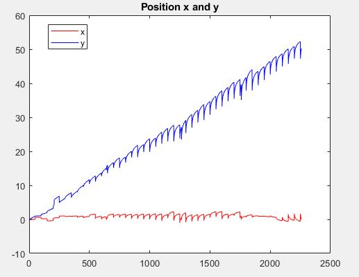

# Meen-689-Group_Project
Group Members
1. Sumil Sood [329006457]
2. Pranav Natu [430000211]
3. Siddharth Sane [829009471]
4. Jay Shah [930001954]
5. Aditya Bitra [230002273]
# Kalman Filter
The data for Accelerometer and GPS was collected using the mobile phone sensors and was collected while holding the mobile still and moving in a straight line for 45 meters at a constant velocity. Although the expected path is a straight line and expected velocity is constant but there is always some disturbances and therefore the actual path is approximated using the Kalman filter.\
The file 'Kalman_filter.m' is the main file and contains all the code required to run the filter to predict states. It has few functions dependencies including
1. Accelero_to_position.m (required to process raw data from accelerometer).
2. Gps_to_bodyframe.m (Required to convert the GPS data which is in global coordinate frame to the local accelerometer body frame) 
The data is collected and stored in two files named 'sensorlog_40.4m.mat' (data from IMU, GPS) and 'meen689' (data from ultrasonic sensor).

The plots of the estimated position and velocity are shown. The results have saw like graph because the estimate tends to divert due the the noisy accelerometer measurements but is kept in check as soon as the GPS measurement comes in whose frequency is less.

# Bayesian Filter
The file 'SensorFusion.m' is the main file for Bayesian Filter.
It will require the following to run:
1)sensorlog_40.4m.mat (data from IMU, GPS)\
2)Accelero_to_position.m (Function to convert acceleration to position, velocity)\
3)Gps_to_bodyframe.m ( Function to convert GPS data to bodyframe)\
4)BayesianEstimate.m ( Function to filter by Bayesian estimate)\
Results
1) Position in X and Y
2) Velocity in X and Y

# Particle Filter
The data that is used in this filter is the same as that in kalman filter. Therefore, as mentioned in the section of kalman filter, please keep files 'meen689' and 'sensorlog_40.4m.mat' in the same folder as particle filter files. 
There are 3 files for the particle filter. The main file is 'particle_filter2d.m', which has the complete algorithm. The other two files namely 'multinomial' and 'residual' are functions that are called in the script.
Process and sensor noises are assumed to be gaussian. There are two resampling methods used: residual and multinomial. Resampling is at the last part of the script and only one method can be used at a time. One of them is commented out and to check the estimae from the other method, comment out the present one and uncomment the other one. Looking at the plots, it is observed that both the methods work equally well in estimating position but in estimating velocity, residual method works better than multinomial (which is expected).
Since multinomial method works with random numbers, each run might give a different result (which is also the case with residual, but very less deviation). Also, increasing the number of particles smoothens out the readings. 
Script will give 2 plots:
1. Position in x and y
2. Velocity in x and y

